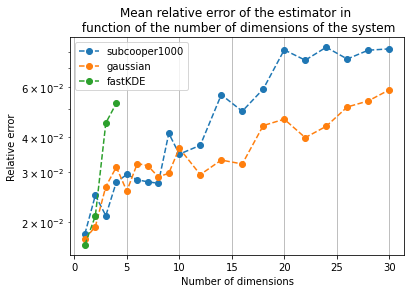

# **Non-parametric Fluctuation-Dissipation theorem**

This repository contains the code from my work on the Fluctuation-Dissipation theorem during my internship at Lawrence Berkeley National Laboratory (LBNL), under the supervision of William D. Collins.

Thgrought this project, we studied a tool for evaluating the response to a perturbation of dynamical systems
by using the fluctuation-dissipation theorem (FDT). Such approach could for instance be very useful
to assess the climate response to an increase in $CO_2$. Following in the footsteps of F. Cooper in https://journals.ametsoc.org/view/journals/atsc/68/5/2010jas3633.1.xml,
we studied a version of this theorem based on non-parametric estimation of PDFs of systems. Such
procedure makes use of Kernel Density Estimators.
After successfully reproducing his results, we try to tackle the issue of dimensionality. Since the
curse of dimensionality is likely to appear quickly for multivariate PDF estimation, we tried to quantify
precisely the decrease in performance due to an increase in the number of dimensions. We restricted our
study to linear models, for which the FDT holds perfectly, but the code is flexible enough to study any dynamical model.

Below is a our results on the increase in the relative error of the estimator while increasing the number of dimensions of the linear dynamical models considered.

 <br />

<p align="center">
 
  
</p>
 <br />

One can read my internship report for insights about the statistical procedure and the way the code is designed :
[https://github.com/amaurylancelin/lbl_project1/blob/779df2fc0d1e07228b662eb2683da5eaba49bf44/npFDT/report.pdf](https://github.com/amaurylancelin/npFDT/blob/ecc158f3fa3e604118237fc41d356d2d0f4362dd/report.pdf)


## **1. Project Structure**

We provide the structure of our project in which you can find usable scripts but also exploration notebooks with comments. 
This code is flexible and made in order to study the response to a constant perturbation of any dynamical systems. The main file is npFDT.py.

```
├── README.md
├── requirements.txt
├── src
    ├── utils.py: some utility functions.
    ├── npFDT.py: our implementation of the npFDT estimation procredure.
    ├── models.py: functions used to define dynamical models.
        
├── output:
    ├── plots
    
├── test_LM.ipynb: a notebook in order to briefly test our procedure on randomly generated linear models.
├── reproduce_CH2011_fig1: a notebook in order to reproduce the first figure of CH2011 with the simplest implementation possible. Not related to npFDT.py.
├── report.pdf: the final report of my intership. The reader will find there useful information about the statistical procedure and the way the code is designed.
    
```
## **2. Installation**
In order to have the good environnement to run this code you need to the following instructions.

### **2.1 With conda (recommanded)**

- Install anaconda
````bash
brew install --cask anaconda
````

- Create an virtual environnement (optional)
```bash
conda create --name <env_name>
conda activate <env_name>
```

- Install all the needed dependencies
```bash
conda install --file requirements.txt
```
 <br />

### **2.2 With pip (not recommanded)**
- Create an virtual environnement (optional)
```bash
python -m venv <env_name>
source <env_name>/bin/activate
```

- Install all the needed dependencies
```
pip install -r requirements.txt
```
 <br />


